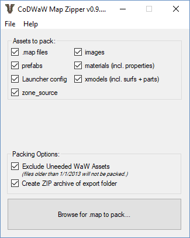

# CoDMapZipper v0.9.1
Attempts to grab all files related to a .map file which are necessary to compile the map. It generates a list of necessary files to pack by using a combination of analytics and file heuristics such as scanning the zone_source files, the .map file itself, the related image files (to grab the material and material_properties), and more.

Use cases:
* You want to create a backup of your entire custom map project in case something bad happens.
* You want to send someone else a complete copy of your custom map project so that they can compile it on their end.

